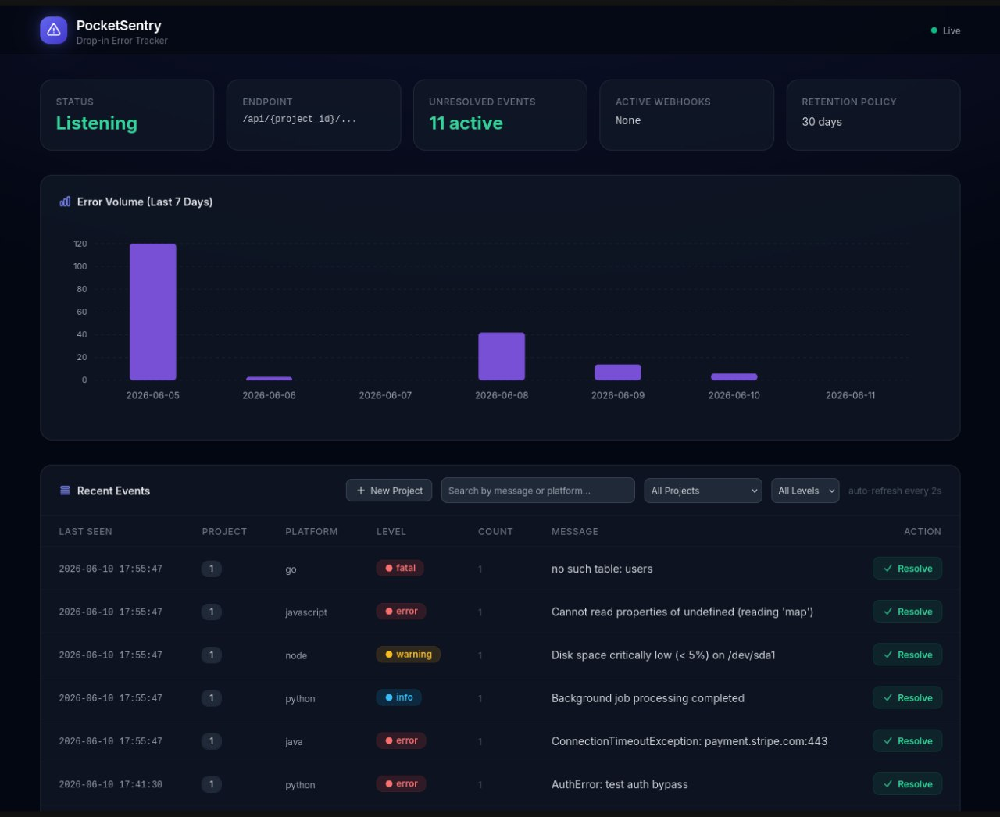

<div align="center">

# 🛡️ PocketSentry

**The 18 MB drop-in Sentry alternative for indie hackers.**

[](https://go.dev)
[](https://www.sqlite.org)
[](https://htmx.org)
[](LICENSE)
[](#-quick-start)

<br>



<br>

*Your Sentry SDKs keep working. Your server bill doesn't.*

</div>

<br>

🌍 Read in: [🇬🇧 English](#english) | [🇷🇺 Русский](#русский)

---

<a id="english"></a>

## 🇬🇧 English

### 🔥 The Problem

Self-hosting [Sentry](https://sentry.io) is an **infrastructure nightmare**:

| What you need | What it costs |
|---|---|
| 40+ Docker containers | Hours of DevOps work |
| Kafka, Redis, ClickHouse, PostgreSQL, Zookeeper… | 16 GB+ RAM minimum |
| `docker-compose.yml` from hell | Constant maintenance |

You just wanted to catch a `TypeError` in your side project. Not deploy a distributed system.

### 💡 The Solution

**PocketSentry** is a single, self-contained binary that speaks the Sentry protocol. Your existing SDKs (`sentry-python`, `@sentry/browser`, `sentry-go`, etc.) connect to it without any code changes — just swap the DSN.

| | Official Sentry (Self-hosted) | PocketSentry |
|---|---|---|
| **Deploy** | 40+ containers, Compose/K8s | **1 file, `./pocketsentry`** |
| **RAM** | 16 GB+ | **< 20 MB** |
| **Database** | PostgreSQL + ClickHouse + Redis | **SQLite (WAL mode + Deduplication)** |
| **Binary size** | Gigabytes of images | **~18 MB** |
| **Dependencies** | Kafka, Zookeeper, Snuba… | **Zero** |
| **Time to deploy** | 30+ minutes | **3 seconds** |
| **CGO** | N/A | **None — pure Go** |

### ✨ Features

- 🔌 **Drop-in compatible** — works with official Sentry SDKs out of the box
- 📦 **Single binary** — templates embedded via `go:embed`, zero external files
- 🪶 **Ultra-lightweight** — ~18 MB binary, < 20 MB RAM at runtime
- 🗄️ **Embedded SQLite** — pure-Go driver ([modernc.org/sqlite](https://modernc.org/sqlite)), no CGO hassle
- 🔄 **Auto-deduplication** — identical errors are grouped by `(project, message, level)` with a hit counter
- 📊 **Real-time dashboard** — dark-themed UI with HTMX auto-refresh (every 2s)
- 🔍 **Detailed Stacktraces** — Clickable rows to view full error details and raw JSON payloads
- 📈 **Analytics & Filters** — Interactive charts and instant HTMX filtering by error level
- 🛡️ **Basic Auth** — Built-in dashboard protection via username and password (ingestion API remains open)
- 🧹 **Retention Policy** — Background auto-cleanup of old events from the database
- 🔒 **Graceful shutdown** — SIGINT/SIGTERM → drain connections → close DB
- 🌐 **Full CORS** — browser SDKs work without proxy hacks
- 🗜️ **Gzip support** — transparent decompression of compressed payloads
- 🧩 **Both endpoints** — `/api/{id}/store/` (legacy) and `/api/{id}/envelope/` (modern)
- 🏥 **Health Check** — `/health` endpoint for uptime monitoring and orchestration
- 🔔 **Webhooks** — Instant error alerts in Telegram and Discord (only for new unique errors)
- 🛠️ **Error Lifecycle** — Resolve errors directly from the dashboard (automatically reopens if the error reoccurs)
- 📂 **Project Management** — Create isolated workspaces for your different apps and fetch dynamic DSNs.
- 🗺️ **Source Maps** — Automatic demangling of minified JavaScript stacktraces via local `.map` files.

### 🚀 Quick Start

**1. Download and run:**

*Option A: Standalone Binary*
```bash
./pocketsentry --port 8080
```

*Option B: Docker*
```bash
docker-compose up -d
```

That's it. Open [http://localhost:8080](http://localhost:8080) to see the dashboard.

**2. Point your SDK:**

<details>
<summary><strong>🐍 Python</strong></summary>

```python
import sentry_sdk

sentry_sdk.init(
    dsn="http://public@localhost:8080/1",
    traces_sample_rate=0,
)

# Test it
raise ValueError("Hello from PocketSentry!")
```

</details>

<details>
<summary><strong>🟨 JavaScript / Node.js</strong></summary>

```javascript
const Sentry = require("@sentry/node");

Sentry.init({
  dsn: "http://public@localhost:8080/1",
});

// Test it
Sentry.captureException(new Error("Hello from PocketSentry!"));
```

</details>

<details>
<summary><strong>🌐 Browser (@sentry/browser)</strong></summary>

```javascript
import * as Sentry from "@sentry/browser";

Sentry.init({
  dsn: "http://public@localhost:8080/1",
});

// Test it
throw new Error("Hello from PocketSentry!");
```

</details>

<details>
<summary><strong>🐹 Go</strong></summary>

```go
import "github.com/getsentry/sentry-go"

func main() {
    sentry.Init(sentry.ClientOptions{
        Dsn: "http://public@localhost:8080/1",
    })
    defer sentry.Flush(2 * time.Second)

    sentry.CaptureMessage("Hello from PocketSentry!")
}
```

</details>

### ⚙️ CLI Options

| Flag | Default | Description |
|---|---|---|
| `--port` | `8080` | HTTP server port |
| `--db` | `pocketsentry.db` | Path to SQLite database file |
| `--admin-user` | `""` | Dashboard admin username (empty = auth disabled) |
| `--admin-pass` | `""` | Dashboard admin password |
| `--retention-days` | `30` | Auto-delete events older than N days (0 = disabled) |
| `--checkupd` | `false` | Check for a newer release on GitHub and update if confirmed |
| `--discord-webhook-url`| `""` | Discord Webhook URL for error notifications |
| `--tg-token` | `""` | Telegram Bot Token for error notifications |
| `--tg-chat-id` | `""` | Telegram Chat ID for error notifications |

Environment variables `PORT` and `DB_PATH` are also supported (flags take priority).

The server handles **graceful shutdown**: press `Ctrl+C` and it will finish in-flight requests, close the database, and exit cleanly.

```
$ ./pocketsentry --port 9090 --db /data/errors.db

   ___           _        _   ___            _
  | _ \ ___  __ | | __ __| |_/ __| ___ _ __ | |_ _ _ _  _
  |  _// _ \/ _|| |/ // _| __\__ \/ _ \ '_ \|  _| '_| || |
  |_|  \___/\__||_\_\\__|\__|___/\___/_||_|\__|_| \_, |
                                                   |__/
  ──────────────────────────────────────────────────
  🛡️  Version     : 1.1.0
  🌐 Dashboard   : http://localhost:9090
  📦 Database    : /data/errors.db
  🔗 DSN         : http://public@localhost:9090/1
  🔓 Auth        : disabled
  🗑️  Retention   : 30 days
  ──────────────────────────────────────────────────

  Point your Sentry SDK to the DSN above.
  Press Ctrl+C to stop.
```

### 🔨 Build from Source

```bash
git clone https://github.com/apvcode/pocketsentry.git
cd pocketsentry
go mod tidy
go build -o pocketsentry .
./pocketsentry
```

**Requirements:** Go 1.22+ (no CGO, no external C libraries).

### 🗺️ Roadmap

- [x] Event detail page with full stack trace
- [x] Retention policies (auto-delete old events)
- [x] Authentication
- [ ] Project management (create/delete projects)
- [ ] Source maps support
- [ ] Docker image

### 📄 License

[MIT](LICENSE) — use it, fork it, ship it.

---

<a id="русский"></a>

## 🇷🇺 Русский

### 🔥 Проблема

Самостоятельный хостинг [Sentry](https://sentry.io) — это **инфраструктурный ад**:

| Что нужно | Чем платишь |
|---|---|
| 40+ Docker-контейнеров | Часы работы DevOps |
| Kafka, Redis, ClickHouse, PostgreSQL, Zookeeper… | 16+ ГБ RAM минимум |
| `docker-compose.yml` из преисподней | Постоянное обслуживание |

Ты просто хотел поймать `TypeError` в своём пет-проекте. А не деплоить распределённую систему.

### 💡 Решение

**PocketSentry** — это один автономный бинарник, который говорит на протоколе Sentry. Твои существующие SDK (`sentry-python`, `@sentry/browser`, `sentry-go` и др.) подключаются к нему без изменений в коде — просто замени DSN.

| | Sentry (Self-hosted) | PocketSentry |
|---|---|---|
| **Деплой** | 40+ контейнеров, Compose/K8s | **1 файл, `./pocketsentry`** |
| **RAM** | 16+ ГБ | **< 20 МБ** |
| **База данных** | PostgreSQL + ClickHouse + Redis | **SQLite (WAL-режим + Дедупликация)** |
| **Размер** | Гигабайты образов | **~18 МБ** |
| **Зависимости** | Kafka, Zookeeper, Snuba… | **Ноль** |
| **Время деплоя** | 30+ минут | **3 секунды** |
| **CGO** | — | **Не нужен — чистый Go** |

### ✨ Возможности

- 🔌 **Drop-in совместимость** — работает с официальными Sentry SDK из коробки
- 📦 **Один бинарник** — шаблоны встроены через `go:embed`, никаких внешних файлов
- 🪶 **Ультралёгкий** — ~18 МБ бинарник, < 20 МБ RAM в рантайме
- 🗄️ **Встроенный SQLite** — pure-Go драйвер ([modernc.org/sqlite](https://modernc.org/sqlite)), без CGO
- 🔄 **Авто-дедупликация** — одинаковые ошибки группируются по `(project, message, level)` со счётчиком
- 📊 **Дашборд реального времени** — тёмная тема, HTMX автообновление каждые 2 секунды
- 🔍 **Detailed Stacktraces** — Кликабельные строки для просмотра детальной информации об ошибке и сырого JSON-пейлоада
- 📈 **Analytics & Filters** — Интерактивные графики и мгновенная фильтрация ошибок по уровням (HTMX)
- 🛡️ **Basic Auth** — Встроенная защита дашборда логином и паролем (API для приема логов остается открытым)
- 🧹 **Retention Policy** — Фоновая авто-очистка старых логов из базы данных
- 🔒 **Graceful Shutdown** — SIGINT/SIGTERM → дождаться запросов → закрыть БД
- 🌐 **Полный CORS** — браузерные SDK работают без проксирования
- 🗜️ **Gzip** — прозрачная декомпрессия сжатых payload'ов
- 🧩 **Оба эндпоинта** — `/api/{id}/store/` (legacy) и `/api/{id}/envelope/` (modern)
- 🏥 **Health Check** — эндпоинт `/health` для мониторинга аптайма и оркестрации
- 🔔 **Уведомления** — Мгновенные алерты об ошибках в Telegram и Discord (только для новых уникальных ошибок)
- 🛠️ **Жизненный цикл ошибок** — Возможность отмечать ошибки как «решенные» прямо из дашборда (автоматически переоткрываются, если баг повторится)
- 📂 **Управление проектами** — Создание отдельных воркспейсов для разных приложений со своими DSN.
- 🗺️ **Source Maps** — Автоматическая расшифровка минифицированных JS-ошибок (просто положите `.map` файлы в папку `sourcemaps/`).

### 🚀 Быстрый старт

**1. Скачай и запусти:**

*Вариант А: Обычный бинарник*
```bash
./pocketsentry --port 8080
```

*Вариант Б: Docker*
```bash
docker-compose up -d
```

Всё! Открой [http://localhost:8080](http://localhost:8080) и смотри дашборд.

**2. Подключи свой SDK:**

<details>
<summary><strong>🐍 Python</strong></summary>

```python
import sentry_sdk

sentry_sdk.init(
    dsn="http://public@localhost:8080/1",
    traces_sample_rate=0,
)

# Проверка
raise ValueError("Привет от PocketSentry!")
```

</details>

<details>
<summary><strong>🟨 JavaScript / Node.js</strong></summary>

```javascript
const Sentry = require("@sentry/node");

Sentry.init({
  dsn: "http://public@localhost:8080/1",
});

// Проверка
Sentry.captureException(new Error("Привет от PocketSentry!"));
```

</details>

<details>
<summary><strong>🌐 Браузер (@sentry/browser)</strong></summary>

```javascript
import * as Sentry from "@sentry/browser";

Sentry.init({
  dsn: "http://public@localhost:8080/1",
});

// Проверка
throw new Error("Привет от PocketSentry!");
```

</details>

<details>
<summary><strong>🐹 Go</strong></summary>

```go
import "github.com/getsentry/sentry-go"

func main() {
    sentry.Init(sentry.ClientOptions{
        Dsn: "http://public@localhost:8080/1",
    })
    defer sentry.Flush(2 * time.Second)

    sentry.CaptureMessage("Привет от PocketSentry!")
}
```

</details>

### ⚙️ Параметры CLI

| Флаг | По умолчанию | Описание |
|---|---|---|
| `--port` | `8080` | Порт HTTP-сервера |
| `--db` | `pocketsentry.db` | Путь к файлу базы данных SQLite |
| `--admin-user` | `""` | Логин для защиты дашборда (пусто = отключено) |
| `--admin-pass` | `""` | Пароль для дашборда |
| `--retention-days` | `30` | Количество дней хранения логов (0 = хранить вечно) |
| `--checkupd` | `false` | Проверить наличие новой версии на GitHub и обновиться при подтверждении |
| `--discord-webhook-url`| `""` | URL вебхука Discord для уведомлений об ошибках |
| `--tg-token` | `""` | Токен Telegram-бота для уведомлений об ошибках |
| `--tg-chat-id` | `""` | ID чата Telegram для уведомлений об ошибках |

### 🗺️ Поддержка Source Maps

PocketSentry умеет автоматически расшифровывать минифицированный JavaScript код из браузера, превращая его в читаемый исходный код с указанием реальных файлов и строк.
Для этого используется максимально простой подход (без сложных загрузок через API):
1. Создайте папку `sourcemaps` рядом с бинарником (или примонтируйте её как Volume в Docker).
2. Положите туда ваши `.map` файлы (например, `main.min.js.map`).
3. При открытии ошибки сервер автоматически найдет карту, восстановит оригинальный код и подсветит нужную строчку в красивом блоке кода прямо в UI.

Также поддерживаются переменные окружения `PORT` и `DB_PATH` (флаги имеют приоритет).

Сервер поддерживает **Graceful Shutdown**: нажми `Ctrl+C`, и он корректно завершит текущие запросы, закроет базу данных и выйдет с кодом 0.

```
$ ./pocketsentry --port 9090 --db /data/errors.db

   ___           _        _   ___            _
  | _ \ ___  __ | | __ __| |_/ __| ___ _ __ | |_ _ _ _  _
  |  _// _ \/ _|| |/ // _| __\__ \/ _ \ '_ \|  _| '_| || |
  |_|  \___/\__||_\_\\__|\__|___/\___/_||_|\__|_| \_, |
                                                   |__/
  ──────────────────────────────────────────────────
  🛡️  Version     : 1.1.0
  🌐 Dashboard   : http://localhost:9090
  📦 Database    : /data/errors.db
  🔗 DSN         : http://public@localhost:9090/1
  🔓 Auth        : disabled
  🗑️  Retention   : 30 days
  ──────────────────────────────────────────────────

  Point your Sentry SDK to the DSN above.
  Press Ctrl+C to stop.
```

### 🔨 Сборка из исходников

```bash
git clone https://github.com/apvcode/pocketsentry.git
cd pocketsentry
go mod tidy
go build -o pocketsentry .
./pocketsentry
```

**Требования:** Go 1.22+ (без CGO, без внешних C-библиотек).

### 🗺️ Дорожная карта

- [x] Страница детального просмотра ошибки со стектрейсом
- [x] Политика хранения (авто-удаление старых событий)
- [x] Аутентификация
- [x] Управление проектами (создание/удаление)
- [x] Поддержка Source Maps
- [x] Docker-образ
- [ ] Экспорт данных логов (CSV/JSON)
- [ ] Умный роутинг уведомлений (разные чаты для разных проектов)
- [ ] Поддержка Транзакций (Performance Monitoring)

### 📄 Лицензия

[MIT](LICENSE) — используй, форкай, шипь.